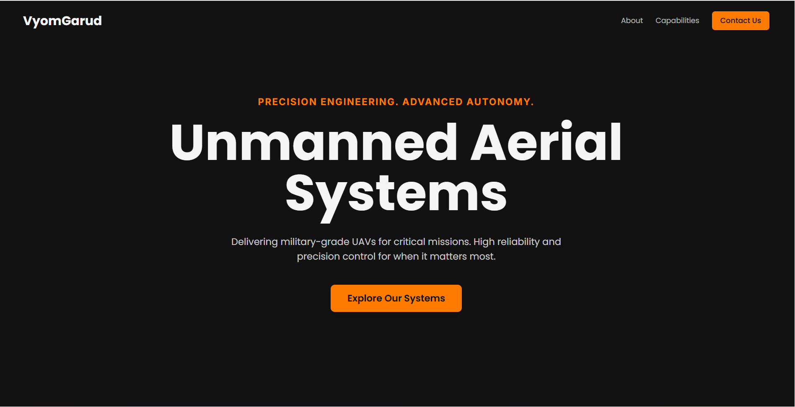
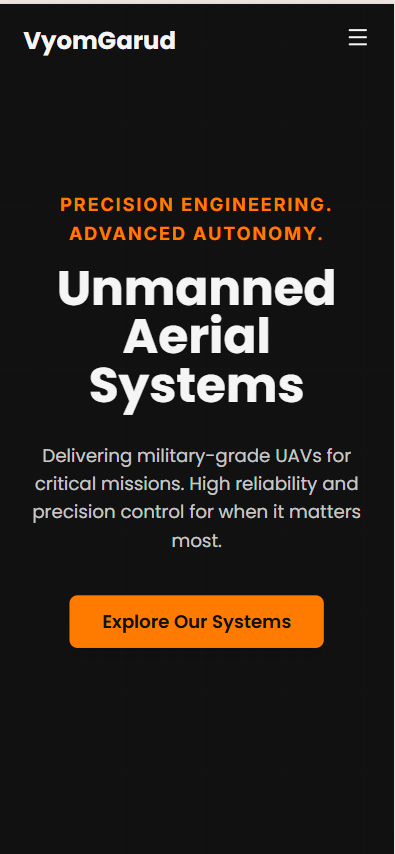

# VyomGarud - Web Developer Intern Assessment

This is the landing page for VyomGarud, a UAV / drone systems company, built as part of the web developer intern assessment.

The page is a modern, responsive, single-page application built with Next.js and Tailwind CSS.

## 🚀 Live Demo 


## 📸 Screenshots





---

## 🛠️ Tech Stack

* **Framework:** Next.js (App Router)
* **Styling:** Tailwind CSS
* **Icons:** Lucide React
* **Font:** Poppins & Inter (from Google Fonts)

---

## 🎨 Design Choices

* **Aesthetic:** Dark, modern, and slightly futuristic/military-grade, following the assignment brief.
* **Colors:**
    * `#111111` (Charcoal/Dark)
    * `#f5f5f5` (Light)
    * `#ff7b00` (Primary Orange)
* **Responsiveness:** The site is fully responsive and tested on desktop and mobile viewports.

---

## Setup and Running Locally

To run this project locally, follow these steps:

1.  **Clone the repository:**
    ```bash
    git clone  https://github.com/Likhith1201/vyomgarud-landing.git
    ```

2.  **Navigate to the project directory:**
    ```bash
    cd vyomgarud-landing
    ```

3.  **Install dependencies:**
    ```bash
    npm install
    ```

4.  **Run the development server:**
    ```bash
    npm run dev
    ```

5.  Open [http://localhost:3000](http://localhost:3000) in your browser.